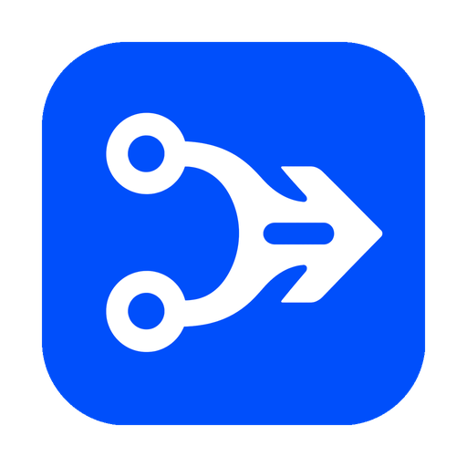

  

<h1 align="center">CONST API</h1>

<strong>All your AI tools. One API.</strong>

Use what you have. Find what you need.

  <a href="https://github.com/llxisdsh/const-api-public/releases/latest">Download</a> ·
  <a href="docs/usage.md">Usage guide</a> ·
  <a href="README.zh-CN.md">简体中文</a> ·
  <a href="https://github.com/llxisdsh/const-api-public/issues">Get help</a>

CONST API gives your AI tools one local connection. Configure a tool once, then use your own models or find the ones you need in the shared Model Marketplace. Available for Windows, macOS, and Linux.

## Why CONST API?

- **Set up once.** Switch API keys, supported subscriptions, local models, or marketplace models without configuring every tool again.
- **Use your own resources first.** CONST API uses your model channels when they are available and automatically turns to the marketplace when they are not.
- **Get models you do not have.** Use an available shared channel without first opening an account with every model provider.
- **See what actually happened.** Price reference shows the expected market price; usage logs show the model, tokens, route, and charge actually used.
- **Change tools safely.** Managed setup is backed up and reversible. Later edits are preserved, and Codex keeps its on-device session history when its connection changes.

## What is the Model Marketplace?

The Model Marketplace connects people who need a model with people who have spare model capacity.

- **Need a model:** use an available channel shared by someone else and pay for the successful request's actual usage.
- **Have spare capacity:** share an API channel, a supported subscription, or a local model at the price you set. Successfully completed requests become supplier earnings.

For each marketplace request, CONST API looks for the exact model first. Among healthy channels within the price limit, lower-priced options are preferred. Active sessions stay on a stable route when possible; failed channels are skipped automatically. You can check the price before a request and verify the result afterward.

Credentials do not enter the marketplace. They stay on the computer running the channel. The platform receives only the model, capability, availability, capacity, and price information needed for routing. A shared request still has to travel through the platform to the selected supplier and model provider to be completed.

## Start

1. [Download](https://github.com/llxisdsh/const-api-public/releases/latest) and open CONST API.
2. When **Local API · Running** appears, click your tool's icon. CONST API takes care of its connection settings.
3. Sign in to use the Model Marketplace. Open **Models** to add your own API channel, supported subscription, or local model.

Need a manual connection or command-line mode? See the [usage guide](docs/usage.md).

## What does it cost?

- **Your own channel:** you pay only the provider, subscription, or local running cost. CONST API does not change it.
- **Model Marketplace:** lower-priced available channels are used first. Check the price before use, then verify the actual usage and charge in **Usage Log**.

## Is it private?

- Your tools connect to the local address `127.0.0.1:38787`.
- With your own channel, requests go directly from your computer to the provider or local model. They do not pass through the CONST API platform.
- With a marketplace channel, requests pass through the platform to the selected supplier and model provider.
- Logs do not store prompts, response text, API keys, account tokens, cookies, or authorization headers.
- Before changing a tool's settings, CONST API creates a backup. Canceling setup removes only CONST API's changes and keeps edits you made later.

## Technical features

- **Native API surfaces.** OpenAI Responses and Chat Completions, Anthropic Messages, and Gemini native interfaces share one local gateway. API channels, supported subscriptions, local models, and marketplace channels all connect through the same model-channel system.
- **Capability-aware protocol handling.** Requests, responses, streaming events, errors, usage, and tool calls follow one operation contract. Native fields pass through unchanged when possible; cross-protocol conversion runs only when needed.
- **Stable, lower-cost routing.** Exact models and your own channels come first. Marketplace routing considers availability, price, quota, concurrency, success rate, and latency, keeps active sessions stable, and moves away from failed channels automatically.
- **Reversible tool configuration.** JSON, JSON5, YAML, and TOML are updated structurally, backed up, and written atomically. Field-level three-way restore preserves later user edits, while Codex keeps its on-device session history across connection changes.
- **Verifiable dynamic registries.** Models, compatibility groups, capabilities, prices, tool metadata, and platform endpoints update independently through Ed25519-signed, content-addressed releases. New data switches atomically only after verification, while the client and server retain a verified snapshot.
- **Reproducible usage and settlement.** Each request freezes its model, price, and supplier offer. Actual usage, route, charge, and settlement evidence are recorded in the ledger and usage log.
- **Adaptive transport.** Platform traffic prefers HTTP/3 and falls back to HTTP/2 or HTTP/1.1. Supplier connections prefer QUIC, fall back to WebSocket, and support encrypted remote links and negotiated compression.

## Open source

The open-source release is in preparation.
