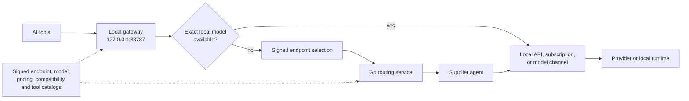

# CONST API

### One local API for the AI tools you already use

Native OpenAI, Anthropic, and Gemini surfaces; reversible tool setup; local, API-key, subscription, and distributed supply; protocol-aware routing with clear operational boundaries.

**English** · [简体中文](README.zh-CN.md)

[Download the desktop client](https://github.com/llxisdsh/const-api-public/releases/latest) · [Read the usage guide](docs/usage.md) · [Report an issue](https://github.com/llxisdsh/const-api-public/issues)

> [!IMPORTANT]
> This repository is currently the public distribution home for CONST API binaries, updater metadata, and signed registries. The clean source release, licensing material, provenance review, and contribution workflow are being prepared. See [Open-source plan](#open-source-plan).

CONST API is a local-first desktop gateway between AI tools and model supply. Tools connect to stable loopback URLs, while the client handles provider credentials, protocol selection, model metadata, endpoint discovery, health, and routing. A tool can keep speaking its native protocol even when the selected supply comes from another supported surface.

## Product

### Use

Pick a detected tool for managed setup, or copy a native URL and the local API key into any compatible client.

### Supply

Bring an API credential, a supported subscription adapter, or a local model runtime. Channels remain local by default; after sign-in, explicitly enabled channels can participate in platform routing.

The Supply screenshot contains illustrative demo data, not a live account or real credentials.

## Start in five minutes

1. Download the package for your operating system from the [latest client release](https://github.com/llxisdsh/const-api-public/releases/latest).
2. Start CONST API and wait for **Local API · Running** on the **Use** page.
3. Click a tool icon for managed setup, or copy the appropriate Base URL and local API key into your tool manually.
4. Open **Supply** only if you want to add your own provider, subscription, or local runtime.

The desktop application also supports tray and foreground command-line operation. Installation, manual API examples, configuration recovery, and every CLI mode are covered in the [English usage guide](docs/usage.md) and [Chinese usage guide](docs/usage.zh-CN.md).

## What it connects

### Managed tools

| Tool | Preferred surface | Managed integration |
| --- | --- | --- |
| ChatGPT / Codex | OpenAI Responses | Provider configuration, program lifecycle, and same-machine Codex session-provider continuity |
| Claude Code | Anthropic Messages | Persistent settings plus isolated environment injection when launched by CONST API |
| Claude Desktop | Anthropic Messages | Local gateway profile and live model-list projection |
| Gemini CLI | Gemini native | Persistent settings plus isolated environment injection when launched by CONST API |
| OpenCode | OpenAI Responses or Chat | Incremental provider configuration and current model snapshot |
| OpenClaw | Responses, Chat, Messages, or Gemini | Protocol-selectable incremental configuration |
| Hermes | OpenAI Chat Completions | Provider configuration with model discovery enabled |
| VS Code | OpenAI Responses or Chat | Built-in BYOK provider and required utility-model settings; extensions are left untouched |
| WorkBuddy | OpenAI Chat Completions | Model-list projection, capability metadata, reasoning options, and complete program lifecycle |

The same local URLs also work with other clients that accept a compatible Base URL and API key; managed configuration is not required.

### Native local surfaces

| Surface | Base URL | Typical operations |
| --- | --- | --- |
| OpenAI | `http://127.0.0.1:38787/v1` | Models, Chat Completions, Responses, embeddings, images, audio, files, batches, and supported stateful operations |
| Anthropic | `http://127.0.0.1:38787/anthropic` | Models, Messages, token counting, files, batches, and supported beta operations |
| Gemini | `http://127.0.0.1:38787/gemini` | Native `v1beta` model and generation methods, including supported streaming and file operations |
| Discovery | `http://127.0.0.1:38787/.well-known/const-api` | Machine-readable surfaces and capabilities |

These are independent protocol surfaces, not aliases for one OpenAI-shaped endpoint. Tools should use their native surface whenever possible.

## Architecture

The local gateway is always the tool-facing boundary. An exact enabled local channel can satisfy a request without platform login or a server round trip; platform routing is used only when the request needs remote capacity.

## Technical design

### Stable tool boundary

- Tools receive fixed loopback URLs and a local device API key. Remote endpoint changes, provider credentials, and failover do not leak into every tool configuration.
- OpenAI, Anthropic, and Gemini paths preserve their own method, path, query, streaming, error, and model-list shapes.
- Formal builds select public services only from a verified endpoint registry. They do not silently fall back to a hard-coded localhost server; local-server selection is an explicit development-only control.
- The same Rust runtime powers desktop, tray, and headless modes, so UI and CLI operation share configuration and behavior.

### Transactional and reversible tool configuration

- Existing JSON, JSON5, YAML, and TOML files are parsed structurally and updated incrementally. Unrelated providers, plugins, MCP entries, and user preferences are preserved.
- Before a managed write, the client records field ownership in `~/.const-api/tool-config-manifest.json`, creates a bounded backup under `~/.const-api/backups`, writes through a same-directory temporary file, and reads the result back.
- **Configure and restart** is one guarded backend operation: discover the program, bind one-time confirmation to the observed process, close and recheck it, commit configuration, cross a final spawn fence, then verify that the new process started.
- **Cancel configuration** performs a field-level three-way restore. A field is restored only while it still equals CONST API's last applied value; later user edits win.
- Claude Code and Gemini CLI receive environment overrides only in child processes launched by CONST API. System environment variables and shell startup files are never modified.

### Codex session continuity

Changing Codex's `model_provider` can make existing sessions disappear from the app even though their files still exist. CONST API handles that provider boundary as part of the same guarded configuration operation:

- visible and archived JSONL sessions, plus the Codex SQLite thread index, are migrated to the active `CONST_API` provider on setup;
- canceling setup migrates CONST-owned sessions—including sessions created while CONST API was active—to the restored provider;
- only provider metadata changes; conversation bodies, tool-call history, formatting, and the official login cache are preserved;
- JSONL writes use atomic replacement and byte-for-byte readback; verification failure restores the original in-memory content, while SQLite state receives bounded backups.

This enables same-machine session continuity between the official OpenAI/Codex path and CONST API without creating a second `CODEX_HOME` or copying conversation histories.

### Protocol-aware exchange

The gateway distinguishes four generation protocols: OpenAI Responses, OpenAI Chat Completions, Anthropic Messages, and Gemini native.

| Path | Behavior |
| --- | --- |
| Same surface | Native pass-through with ordered headers, escaped path/query, unknown fields, and provider-specific payloads preserved; only required routing/authentication surgery is applied |
| Cross-surface text | Canonical intermediate representation for the supported non-stream matrix |
| Function tools | Bidirectional Chat/Responses tool history and common function-tool mapping; basic Anthropic/Gemini tool-result mapping |
| Streaming | Bidirectional Chat/Responses text and function-tool streams; canonical text streaming for supported Anthropic/Gemini paths |
| Advanced semantics | Explicitly classified as `native_passthrough`, `lossless_text`, `lossy`, or `unsupported`; multimodal, cache-control, hosted-tool, and thinking details are never silently claimed to be lossless |

Opaque reasoning payloads such as backend-specific `encrypted_content` are removed only when crossing a backend boundary that cannot safely reuse them. Visible reasoning text, normal messages, and tool history remain intact.

### Flexible supply with bounded trust

- API-key channels cover OpenAI, OpenRouter, Azure OpenAI, Anthropic, Gemini, Amazon Bedrock through Mantle-compatible surfaces, custom endpoints, and local engines such as Ollama, LM Studio, and vLLM.
- Supported subscription adapters keep account tokens local, refresh them locally, discover models dynamically, and report real quota windows when the upstream exposes them.
- Each server endpoint uses one long-lived supplier-agent connection carrying multiple logical channels. QUIC is preferred; WebSocket is the fallback, with periodic recovery toward QUIC.
- Negotiated `zstd_frame_v2` compression is used only for payloads above the threshold and only when the compressed frame plus its header is smaller than the original.
- Channel registration reports identity, surface, model, capability, quota, health, and limit metadata—not raw provider credentials.
- Per-channel concurrency, RPM, daily limits, cooldowns, authentication state, quota state, and terminal stream errors feed the safety state instead of being flattened into a generic online/offline flag.

### Explainable routing and cost control

- Exact model matching is the default. Compatibility substitution is a distinct, user-controlled policy and is not used as a silent model rename.
- Candidates are separated into ready and fallback pools, then ranked using native-surface evidence, conversion level, requested capabilities, latency, capacity, health, and price.
- A hard price ceiling is enforced first; the primary pool remains within a narrow band of the lowest eligible offer before quality and capacity decide among candidates.
- Sticky routing keeps a user/model/protocol/path affinity for a bounded window to reduce conversation drift.
- Retries happen only for retryable failures before output begins. CONST API never silently switches suppliers in the middle of a response stream.
- The route trace and debug console expose inbound and selected protocols, conversion level, candidate filtering and scoring, selected channel/model mapping, response bytes, SSE events, tool calls, finish reason, and the layer that failed.

### Signed registries, not code fallbacks

- The endpoint registry is an Ed25519-signed manifest checked against pinned key IDs, expiry, client-version bounds, URL authority, and QUIC certificate pins.
- The catalog registry is a signed, content-addressed root over separate model, pricing, compatibility, and tool components. Every component hash and cross-projection must validate before an atomic activation.
- Client and server releases embed verified snapshots generated from the same source. Runtime refresh can advance to a newer signed sequence, but anti-rollback rules reject older catalog state.
- Model metadata and prices can therefore be updated without shipping a new desktop binary; new protocol semantics still require a client release.

### Privacy, diagnostics, and accounting

- Production call history stores operational metadata—route, protocol, model, status, byte and token counts, latency, cost, error class, and stream shape—not prompts, responses, tool arguments, cookies, authorization headers, or provider keys.
- Raw protocol logging is an explicit debug-build facility and is hard-disabled in release builds.
- Provider credentials remain on the machine executing the channel and are never copied into the public registries or supplier registration payload.
- Billing locks the model, price snapshot, and applicable ratios when a request begins. Terminal upstream usage is preferred; conservative estimation is used only when authoritative usage is absent, and one ledger outcome is committed.
- Updates wait for local requests, supplier work, pending responses, and replay acknowledgements to drain instead of forcing a timeout restart through active traffic.

## Desktop and command line

One executable supports four operating styles:

| Command | Purpose |
| --- | --- |
| `const-api-client` | Open the desktop window; closing it keeps the runtime in the tray or menu bar |
| `const-api-client --tray` | Start hidden with a tray/menu-bar entry; used by start-at-login |
| `const-api-client --headless` | Run the same saved configuration in the foreground, without UI or tray; logs stay in the terminal |
| `const-api-client --check` | Validate saved configuration and report active runtime state, then exit without starting services |

Only one active runtime owns a configuration directory. See [Command-line operation](docs/usage.md#command-line-operation) for platform-specific commands, exit codes, and coexistence rules.

## Distribution channels

| Artifact | Public channel | Update model |
| --- | --- | --- |
| Desktop client | [Latest release](https://github.com/llxisdsh/const-api-public/releases/latest) | Versioned Windows, macOS, and Linux packages plus signed Tauri updater metadata |
| Endpoint registry | [Fixed `endpoint-registry` release](https://github.com/llxisdsh/const-api-public/releases/tag/endpoint-registry) | Signed mutable asset with monotonic manifest versioning |
| Catalog registry | [Fixed `catalog-registry` release](https://github.com/llxisdsh/const-api-public/releases/tag/catalog-registry) | Signed content-addressed catalog root and immutable component assets |
| Server image | `ghcr.io/llxisdsh/const-api-server` | Versioned container tags plus `latest` |

> [!WARNING]
> Current desktop packages are for trusted testing. They do not have Apple Developer ID signing/notarization, Windows code signing, or Linux package signing. macOS bundles use an ad-hoc signature for bundle integrity, and updater artifacts use a Tauri update signature; neither is an operating-system publisher signature. Install only assets downloaded from this repository and review the release notes before bypassing an OS warning.

## Documentation

- [Usage guide](docs/usage.md) · [使用指南](docs/usage.zh-CN.md)
- [Client releases](https://github.com/llxisdsh/const-api-public/releases)
- [Issue tracker](https://github.com/llxisdsh/const-api-public/issues)

## Open-source plan

CONST API is moving toward a source release deliberately rather than publishing an unreviewed private history.

| Workstream | Status |
| --- | --- |
| Public desktop installers, updater metadata, endpoint registry, and catalog registry | Available now |
| Clean source history with secrets and private operational material removed | In progress |
| Dependency, asset, model-data, trademark, and provenance review | In progress |
| Final license, `NOTICE`, security policy, and contribution guide | In progress |
| Reproducible public build and release documentation | Planned with the source release |

Until that work is complete, this repository should be understood as a public distribution and documentation repository—not yet as the licensed source repository. Issues about releases, compatibility, installation, and documentation are welcome now; source contributions will open with the source tree and contribution policy.
