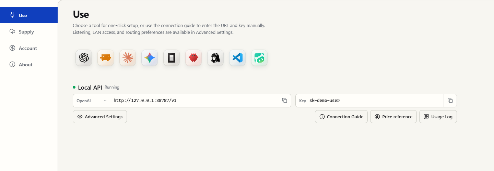
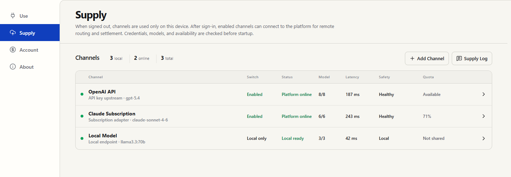
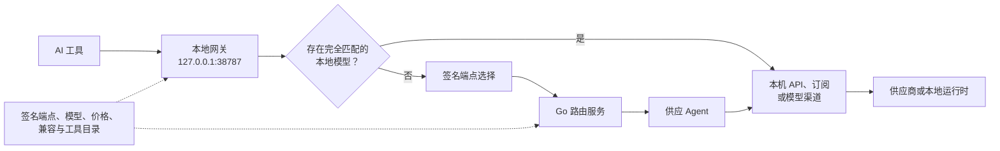

# CONST API

### 为你已经在使用的 AI 工具提供一个本地 API

原生 OpenAI、Anthropic 与 Gemini 接口，可恢复的工具配置，本地/API Key/订阅/分布式供应，以及边界清晰、协议感知的路由。

[English](README.md) · **简体中文**

[下载桌面客户端](https://github.com/llxisdsh/const-api-public/releases/latest) · [阅读使用指南](docs/usage.zh-CN.md) · [反馈问题](https://github.com/llxisdsh/const-api-public/issues)

> [!IMPORTANT]
> 当前仓库是 CONST API 二进制程序、更新元数据和签名目录的公开发布仓库。干净的源码发布、许可证材料、来源审查与贡献流程仍在准备中，详见[开源计划](#开源计划)。

CONST API 是位于 AI 工具与模型供应之间的本地优先桌面网关。工具只连接稳定的回环地址；供应商凭据、协议选择、模型元信息、端点发现、健康状态与路由都由客户端管理。工具可以继续使用自己的原生协议，同时由另一种受支持的供应接口完成请求。

## 产品

### 使用

选择已发现的工具进行托管配置，或者把原生协议地址和本地 API Key 手动填入任意兼容客户端。

### 供应

接入 API 凭据、受支持的订阅适配器或本地模型运行时。渠道默认只在本机使用；登录后，只有显式启用的渠道才会参与平台路由。

供应页截图使用的是说明性演示数据，不是真实账户或真实凭据。

## 五分钟开始使用

1. 从[最新客户端 Release](https://github.com/llxisdsh/const-api-public/releases/latest)下载对应操作系统的安装包。
2. 启动 CONST API，在**使用**页等待状态变为**本地 API · 运行中**。
3. 点击工具图标进行托管配置，或者把对应 Base URL 与本地 API Key 手动填入工具。
4. 仅在需要添加自己的供应商、订阅或本地运行时时打开**供应**页。

桌面程序同时支持托盘和前台命令行运行。安装、手动 API 示例、配置恢复以及全部 CLI 模式见[中文使用指南](docs/usage.zh-CN.md)和[英文使用指南](docs/usage.md)。

## 可以接入什么

### 托管工具

| 工具 | 首选接口 | 托管能力 |
| --- | --- | --- |
| ChatGPT / Codex | OpenAI Responses | Provider 配置、程序生命周期与同机 Codex session provider 连续性 |
| Claude Code | Anthropic Messages | 持久配置；由 CONST API 启动时进行隔离的子进程环境注入 |
| Claude Desktop | Anthropic Messages | 本地网关 profile 与实时模型列表投影 |
| Gemini CLI | Gemini 原生接口 | 持久配置；由 CONST API 启动时进行隔离的子进程环境注入 |
| OpenCode | OpenAI Responses 或 Chat | 增量 provider 配置与当前模型快照 |
| OpenClaw | Responses、Chat、Messages 或 Gemini | 可选择协议的增量配置 |
| Hermes | OpenAI Chat Completions | Provider 配置与模型发现 |
| VS Code | OpenAI Responses 或 Chat | 内置 BYOK provider 与必要的 utility-model 设置；不改动扩展 |
| WorkBuddy | OpenAI Chat Completions | 模型列表投影、能力元信息、思考强度选项与完整程序生命周期 |

其它接受兼容 Base URL 与 API Key 的客户端也可以直接使用这些本地地址，不要求托管配置。

### 原生本地接口

| 接口 | Base URL | 典型操作 |
| --- | --- | --- |
| OpenAI | `http://127.0.0.1:38787/v1` | 模型、Chat Completions、Responses、向量、图片、音频、文件、Batch 与受支持的有状态操作 |
| Anthropic | `http://127.0.0.1:38787/anthropic` | 模型、Messages、Token 计数、文件、Batch 与受支持的 beta 操作 |
| Gemini | `http://127.0.0.1:38787/gemini` | 原生 `v1beta` 模型与生成方法，包括受支持的流式和文件操作 |
| 发现清单 | `http://127.0.0.1:38787/.well-known/const-api` | 机器可读的接口与能力信息 |

它们是彼此独立的协议接口，并非同一个 OpenAI 兼容地址的别名。工具能够使用原生接口时，应优先使用原生接口。

## 架构

面向工具的边界始终是本地网关。启用的本机渠道如果具备完全匹配的模型，可以在不登录平台、也不经过服务器的情况下完成请求；只有需要远程容量时才进入平台路由。

## 技术设计

### 稳定的工具边界

- 工具只获得固定回环地址和本机设备 API Key。远端端点变化、供应商凭据与故障切换不会扩散到每一份工具配置中。
- OpenAI、Anthropic 和 Gemini 路径分别保留自己的 method、path、query、stream、错误形状与模型列表语义。
- 正式版只从已验证的端点目录选择公网服务，不会静默回退到代码里写死的本地服务器；本地服务是仅开发模式可见、需要显式选择的入口。
- 桌面、托盘与 headless 模式复用同一个 Rust Runtime，因此 UI 与 CLI 使用同一份配置和同一套行为。

### 事务化、可恢复的工具配置

- 现有 JSON、JSON5、YAML 与 TOML 文件采用结构化解析和增量更新；无关的 provider、插件、MCP 与用户偏好保持不变。
- 托管写入前，客户端把字段所有权记录在 `~/.const-api/tool-config-manifest.json`，在 `~/.const-api/backups` 创建有界备份，经同目录临时文件原子替换，并回读验证结果。
- **配置并重启**是一个受保护的后端 operation：发现程序，把一次性确认绑定到当前进程，关闭并复验，提交配置，通过最后的启动栅栏，再确认新进程确实启动。
- **取消配置**执行字段级三方恢复。仅当字段仍等于 CONST API 最后应用值时才恢复；配置后用户主动修改的值优先保留。
- Claude Code 与 Gemini CLI 的环境变量只注入 CONST API 启动的子进程，不修改系统环境变量或 shell 启动文件。

### Codex 会话连续性

仅仅改变 Codex 的 `model_provider`，就可能让现有 session 在界面中消失，即使实际文件仍然存在。CONST API 把这个 provider 边界纳入同一个受保护的配置 operation：

- 配置时，把可见/归档 JSONL session 与 Codex SQLite thread 索引迁移到当前 `CONST_API` provider；
- 取消配置时，把 CONST 拥有的 session——包括配置期间新建的 session——迁移到恢复后的 provider；
- 只修改 provider 元数据，不修改会话正文、工具调用历史、换行格式和官方登录缓存；
- JSONL 采用原子替换与逐字节回读，验证失败会用内存中的原文恢复；SQLite 状态保留有界备份。

因此，官方 OpenAI/Codex 路径与 CONST API 可以在同一台机器上保持 session 连续性，无需创建第二个 `CODEX_HOME`，也无需复制会话正文。

### 协议感知的交换层

网关明确区分四种生成协议：OpenAI Responses、OpenAI Chat Completions、Anthropic Messages 与 Gemini 原生协议。

| 路径 | 行为 |
| --- | --- |
| 同接口 | 原生透传有序 header、转义后的 path/query、未知字段和供应商私有 payload，只做路由和鉴权所必需的修改 |
| 跨接口文本 | 对受支持的非流式矩阵使用 canonical 中间表示 |
| Function tools | Chat/Responses 工具历史双向转换；常见函数工具与基础 Anthropic/Gemini tool result 映射 |
| 流式 | Chat/Responses 文本与 function-tool 双向流式转换；受支持的 Anthropic/Gemini 路径使用 canonical 文本事件流 |
| 高级语义 | 明确标记为 `native_passthrough`、`lossless_text`、`lossy` 或 `unsupported`；不会把多模态、cache control、hosted tool 或 thinking 的差异静默声称为无损 |

只有跨越无法安全复用 opaque reasoning 的后端边界时，才会移除 `encrypted_content` 等私有加密载荷；可见思考文本、普通消息与工具历史保持不变。

### 灵活供应与有界信任

- API Key 渠道覆盖 OpenAI、OpenRouter、Azure OpenAI、Anthropic、Gemini、通过 Mantle 兼容接口接入的 Amazon Bedrock、自定义端点，以及 Ollama、LM Studio、vLLM 等本地运行时。
- 受支持的订阅适配器在本地保存和刷新账户 token，动态发现模型，并在上游提供数据时展示真实 quota 窗口。
- 每个服务器端点维持一条承载多个逻辑渠道的长连接供应 Agent；优先 QUIC，失败时回退 WebSocket，并周期性尝试恢复到 QUIC。
- 协商后的 `zstd_frame_v2` 只在 payload 超过阈值、且压缩帧加 header 仍小于原文时启用。
- 渠道注册只上报身份、接口、模型、能力、额度、健康与限额元信息，不上报原始供应商凭据。
- 每渠道并发、RPM、每日限额、冷却、鉴权状态、额度状态与流式终止错误共同形成安全状态，不会被压扁成一个笼统的在线/离线标记。

### 可解释路由与成本控制

- 默认要求模型精确匹配。兼容模型替换是独立、由用户控制的策略，不会作为静默改名使用。
- 候选先分为 ready 与 fallback 池，再按原生接口证据、转换等级、请求能力、延迟、容量、健康和价格排序。
- 先执行价格硬上限；主池保持在最低合格报价的窄幅区间内，再由质量与容量决定具体候选。
- 有界的 sticky routing 按用户/模型/协议/路径维持亲和性，减少连续对话漂移。
- 只有在尚未输出内容、且错误可重试时才会重试；响应流中途不会静默切换供应端。
- Route trace 与调试台会解释入站/选中协议、转换等级、候选过滤与打分、渠道和模型映射、响应字节、SSE 事件、工具调用、finish reason 与失败层级。

### 使用签名目录，而不是代码回退

- 端点目录是 Ed25519 签名清单，按内置 key ID、有效期、客户端版本范围、URL authority 与 QUIC 证书 pin 进行验证。
- 模型目录是签名、内容寻址的根清单，分别引用模型、价格、兼容与工具组件；所有组件 hash 与交叉投影都通过后才会原子激活。
- 客户端和服务器发布时嵌入由同一来源生成的已验证快照。运行时可以刷新到更高签名 sequence，防回滚规则会拒绝旧目录。
- 因此模型元信息和价格可以不发布新桌面程序就更新；新的协议语义仍需要客户端版本支持。

### 隐私、诊断与计费

- 正式版调用历史只保存运行元信息：路由、协议、模型、状态、字节数、Token 数、延迟、成本、错误类别和 stream 形状；不保存 prompt、response、工具参数、Cookie、Authorization header 或供应商 Key。
- 原始协议日志只存在于显式开启的 debug 构建中，release 构建会强制关闭。
- 供应商凭据留在实际执行渠道的机器上，不会写入公开目录或供应注册 payload。
- 请求开始时锁定模型、价格快照和相关倍率；优先采用上游最终 usage，只有缺少权威数据时才保守估算，并且只提交一个账本结果。
- 自动更新会等待本地请求、供应任务、待发送响应与重放确认自然排空，不会用强制超时重启穿过活跃流量。

## 桌面与命令行

同一个可执行文件支持四种运行方式：

| 命令 | 用途 |
| --- | --- |
| `const-api-client` | 打开桌面窗口；关闭窗口后继续驻留托盘或菜单栏 |
| `const-api-client --tray` | 隐藏窗口启动并保留托盘/菜单栏入口；“登录时启动”使用此模式 |
| `const-api-client --headless` | 使用同一份配置在当前终端前台运行，不创建 UI 或托盘；日志留在终端 |
| `const-api-client --check` | 检查已保存配置与当前运行时状态，然后退出，不启动服务 |

同一配置目录只能有一个 Active Runtime。平台命令、退出码和共存规则见[命令行运行](docs/usage.zh-CN.md#命令行运行)。

## 发布渠道

| 内容 | 公开渠道 | 更新方式 |
| --- | --- | --- |
| 桌面客户端 | [最新 Release](https://github.com/llxisdsh/const-api-public/releases/latest) | Windows、macOS、Linux 版本化安装包与签名 Tauri updater 元数据 |
| 端点目录 | [固定 `endpoint-registry` Release](https://github.com/llxisdsh/const-api-public/releases/tag/endpoint-registry) | 带单调清单版本的签名可变资产 |
| 模型目录 | [固定 `catalog-registry` Release](https://github.com/llxisdsh/const-api-public/releases/tag/catalog-registry) | 签名内容寻址根清单与不可变组件资产 |
| 服务端镜像 | `ghcr.io/llxisdsh/const-api-server` | 版本化镜像 tag 与 `latest` |

> [!WARNING]
> 当前桌面包仅供可信测试。它们没有 Apple Developer ID 签名/公证、Windows 代码签名或 Linux 包签名。macOS 应用使用 ad-hoc 签名保护 bundle 完整性，自动更新资产使用 Tauri updater 签名；两者都不是操作系统认可的发布者签名。只安装从本仓库下载的资产，并在绕过系统提示前阅读 Release 说明。

## 文档

- [使用指南](docs/usage.zh-CN.md) · [Usage guide](docs/usage.md)
- [客户端 Releases](https://github.com/llxisdsh/const-api-public/releases)
- [问题反馈](https://github.com/llxisdsh/const-api-public/issues)

## 开源计划

CONST API 正在有计划地走向源码公开，而不是直接发布一份未经审查的私有历史。

| 工作项 | 状态 |
| --- | --- |
| 公开桌面安装包、updater 元数据、端点目录和模型目录 | 已提供 |
| 清理密钥和私有运维材料后的干净源码历史 | 进行中 |
| 依赖、资源、模型数据、商标与来源审查 | 进行中 |
| 最终许可证、`NOTICE`、安全策略与贡献指南 | 进行中 |
| 可复现的公开构建与发布文档 | 随源码发布提供 |

在这些工作完成前，本仓库应被理解为公开发布与文档仓库，而不是已经完成授权的源码仓库。现在即可提交安装、Release、兼容性和文档问题；源码与贡献政策发布后再开放源码贡献。

**CONST API 的开源计划正在进行中。**
